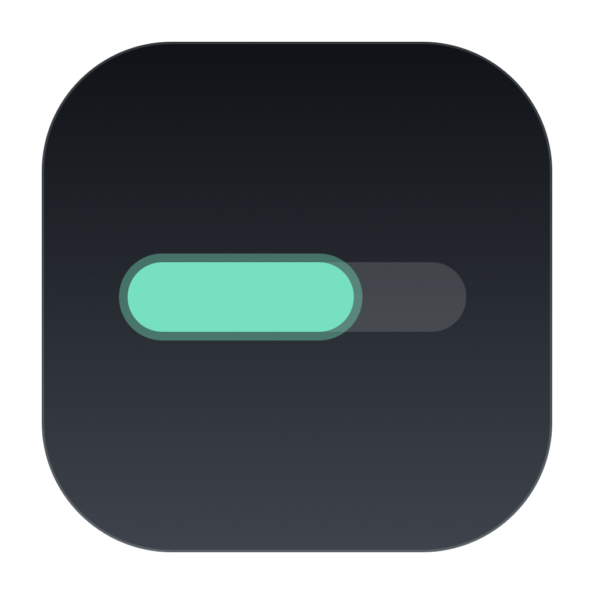
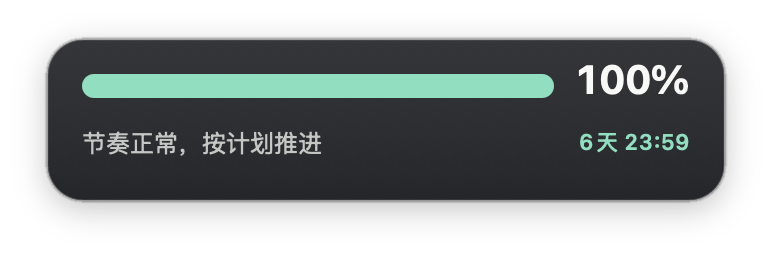
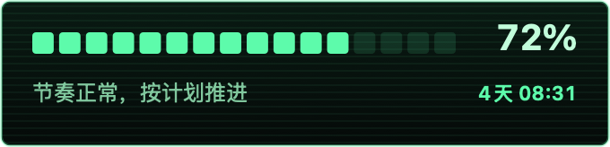
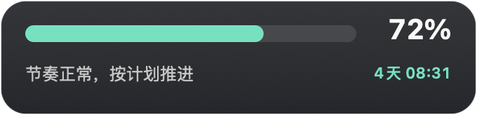

# Codex Usage Strip

<p align="center"></p>

Codex Usage Strip 是一个常驻 macOS 桌面的 Codex 每周额度组件。它只显示剩余额度、进度条和刷新倒计时，不承担聊天或任务执行。



## 核心能力

- 只读取 Codex 总额度中的每周窗口，忽略模型独立额度。
- 同时显示剩余百分比、进度条、重置时间和倒计时。
- 支持浮在所有窗口之上，或贴近桌面层显示。
- 四角等比缩放，拖拽区域带明确光标反馈。
- 10 套内置皮肤、8 种显示形态（含 3 种极简样式、1 种方形圆环样式和顶部状态栏模式）、5 种背景图片布局。
- 自定义背景图、背景透明度和整体透明度。
- 自定义状态话术，支持 `{remaining}`、`{used}`、`{countdown}`、`{resetTime}`、`{pace}`、`{updatedAt}`。
- 开机启动、额度提醒、配置导入导出。
- 通过 Sparkle 提供 EdDSA 校验的自动更新。

## 安装

当前公开版本采用免费发布方式，不使用付费的 Apple Developer ID 证书。应用可以正常使用，但第一次启动时 macOS 会要求你手动确认一次。请只从本仓库的 [GitHub Releases](https://github.com/PengXiaoyi/codex-usage-strip/releases) 下载。

### 方法一：DMG 安装（推荐）

1. 打开 [最新版本下载页](https://github.com/PengXiaoyi/codex-usage-strip/releases/latest)。
2. 下载名称以 `.dmg` 结尾的文件。
3. 打开 DMG，把 `Codex Usage Strip.app` 拖到 `Applications`。
4. 前往“应用程序”并打开 `Codex Usage Strip`。
5. 如果 macOS 阻止启动，按照下方的“首次打开”操作一次。

### 方法二：ZIP 安装

适用于无法打开 DMG，或希望直接取得 `.app` 的用户。

1. 打开 [最新版本下载页](https://github.com/PengXiaoyi/codex-usage-strip/releases/latest)。
2. 下载名称以 `.zip` 结尾的文件并解压。
3. 把 `Codex Usage Strip.app` 移到“应用程序”文件夹。
4. 打开应用；如被 macOS 阻止，按照下方的“首次打开”操作一次。

### 方法三：从源码构建

适合希望自行检查代码或参与开发的用户：

```bash
git clone https://github.com/PengXiaoyi/codex-usage-strip.git
cd codex-usage-strip
make build
open ".artifacts/Codex Usage Strip.app"
```

首次构建会通过 Swift Package Manager 获取 Sparkle 2.9.2。执行自检：

```bash
make test
```

### 首次打开

由于公开安装包没有 Apple Developer ID 签名，直接双击时 macOS 可能显示“无法验证开发者”或“Apple 无法检查其是否包含恶意软件”。这是免费分发版本的预期行为：

1. 先尝试打开一次应用，然后关闭提示。
2. 打开“系统设置 → 隐私与安全性”。
3. 滚动到“安全性”，找到被阻止的 `Codex Usage Strip`。
4. 点击“仍要打开”，输入 Mac 登录密码并再次确认。

确认后，这台 Mac 会把应用保存为例外，后续可以正常双击启动。不要为了安装本应用关闭整个系统的安全检查，也不需要运行 `xattr` 或修改 Gatekeeper。

如果“仍要打开”没有出现，请先从“应用程序”中再次打开一次；该按钮通常只会在应用刚被系统阻止后显示。参见 [Apple 官方说明](https://support.apple.com/guide/mac-help/mh40616/mac)。

## 运行要求

- macOS 14 或更高版本。
- 本机已安装并登录 ChatGPT/Codex，或已安装可执行的 Codex CLI。
- 当前版本优先读取 `/Applications/ChatGPT.app/Contents/Resources/codex`，也支持 `CODEX_PATH` 指定路径。

Codex Usage Strip 使用本机 Codex 的 `account/rateLimits/read` 接口读取额度。该接口不是稳定的公开兼容承诺；上游格式变化时，Codex Usage Strip 可能需要同步更新。

## 打包

生成本地 ZIP 和 DMG：

```bash
make package
```

免费发布包使用 ad-hoc 签名，Sparkle 更新压缩包另行使用 EdDSA 签名校验。它不能替代 Apple Developer ID 与公证，因此首次启动仍会出现上述系统确认。发布维护方式见 [发布说明](docs/RELEASING.md) 与 [GitHub 仓库设置](docs/REPOSITORY_SETUP.md)。

## 更新与卸载

- 正式 Release 支持在应用菜单中检查更新；下载的更新包会经过 Sparkle EdDSA 校验。
- 如果自动更新不可用，可以从 GitHub Releases 下载新版并覆盖“应用程序”中的旧版本，配置不会丢失。
- 卸载时退出应用，再从“应用程序”中删除 `Codex Usage Strip.app`。如果开启过“登录时启动”，请先在设置中关闭。

## 皮肤与背景

| 纸感白 | 樱花粉 | 终端绿 |
|---|---|---|
|  |  |  |

| 石墨黑 | 赛博紫 | 交通灯 |
|---|---|---|
|  |  |  |

用户可以在设置中直接选择 PNG、JPEG、WebP 或 HEIC 图片作为背景，并分别调整背景图片透明度与整个组件透明度。皮肤也可以通过 `.quotatheme` 文件导入导出。

新增的 `System Light`、`System Dark` 和 `System Blue` 皮肤使用系统字体、低对比材质和单一语义色，适合搭配极简显示形态。

`Square Light` 皮肤适合搭配“方形圆环”显示形态：圆环表达剩余额度，百分比固定在圆心，底部显示重置倒计时。

“顶部状态栏”模式会隐藏桌面悬浮窗，仅在 macOS 状态栏显示圆形进度和剩余百分比；点击标签可刷新数据、打开设置或切换回桌面形态。

## 隐私

Codex Usage Strip 不要求账号密码，不上传额度、背景图片或配置。额度请求由本机 Codex 进程完成。完整边界见 [PRIVACY.md](PRIVACY.md)。

## 项目状态

当前开源候选版本为 `2.2.0 (5)`。功能已经冻结，后续变更优先处理兼容性、安全性和可维护性。

## 参与贡献

提交问题前请先阅读 [CONTRIBUTING.md](CONTRIBUTING.md) 和 [SECURITY.md](SECURITY.md)。

## 许可

[MIT License](LICENSE)。Codex Usage Strip 是独立社区项目，与 OpenAI 无隶属或官方背书关系；Codex、ChatGPT 及相关商标归其权利人所有。
